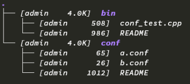
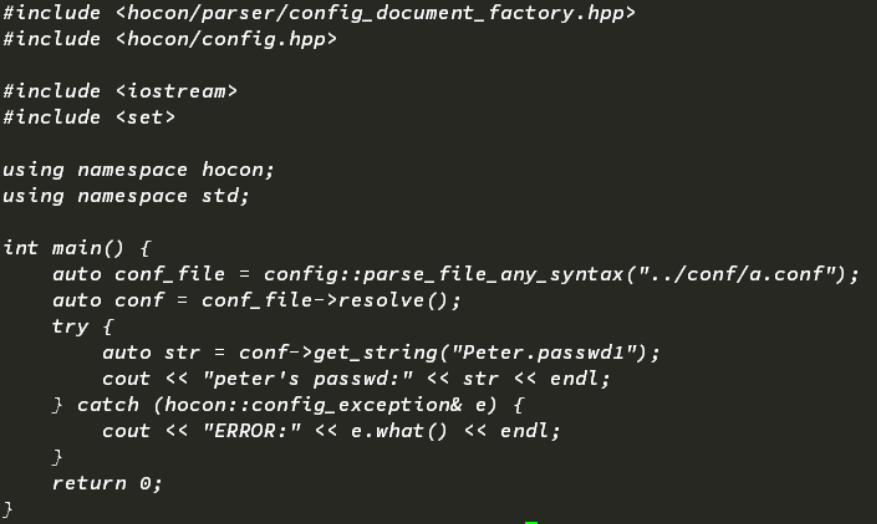

# C++ HOCON Parser


This is a port of the TypesafeConfig library to C++.

The library provides C++ support for the [HOCON configuration file format](https://github.com/typesafehub/config/blob/master/HOCON.md).

## I Made Some Change

Error occured when I was using cpp-hocon to parse some config files in our project. That motivates me to fork the origin project of cpp-hocon, and change some code to fulfill my goal in using it. I'm not sure what I've done is right, and I don't know where anyone else is in the same situation. Next I'll tell you what my problem is, and how I fix it even in not-sure-correct way.

## My Problem

I'll use a simple example case to illustrate what the problem is. As is shown in the following image, in my example directory exist two sub_dirs, "bin" and "conf".



Under conf directory lays two config file, "a.conf" and "b.conf". The content of a.conf is *{ Peter : { include file("b.conf") } }* , and the content of b.conf is *{ passwd1 : "asdf" }*. And the following image is test code.



When I compile the code in directory "bin", and run the binary in "bin", I got an error. 

However when I run the binary in directory "conf", I could get the expected outputs.

## My Solution

I thought it was the parser that can not parse included file in a relative path based on the directory of including file. Then I change some code to make it happen. 

I am not sure what I've done is the right way to solve this problem. And I also don't know what kinds of bugs this change would make. So I post my code (both my change code and test code) to you, and hoping someone have a better idea to fix it.


```
          MMMMMMMMMMMMMMMMMMMM
         .====================.
         MMMMMMMMMMMMMMMMMMMMMM
        .MMMMMMMMMMMMMMMMMMMMMM.
    ===.7MMMIN7NMMMMMMMMM7M=MMMM,===
    MMM.7MM:     DMMMMM7    :MMM=MMM
    MMM.7MM,     DMMMMM?    ~MMM=MMM
    MMM.7MMM~++~?MMMMMMM~++~MMMM=MMM
        .MMMMMMMMMMMMMMMMMMMMMM.
         MMMMMMMMMMMMMMMMMMMMMM
         MMMMMMMMMMMMMMMMMMMMMM
         MMM      HOCON     MMM
         MMMMMMMMMMMMMMMMMMMMMM
          .MMMMMMMMMMMMMMMMMM.
          .MMMMMMMMMMMMMMMMMM.
       .MMMMMMMMMMMMMMMMMMMMMMMM
 .    MMMMMMMMMMMMM88MMMMMMMMMM8MM    .
7=MMMMMMMM++ A CONFIG FILE  ++M8MMMMMM7=
M=MMMMMMMM+ FORMAT DESIGNED  +M8MMMMMM7M
M=MMMMMMMM++  FOR HUMANS   ++M8MMMMMM7M
 =MMMMMMMMMMMMMMMMM88MMMMMMMMMM8MMMMMM7
  7MM.88MMMMMMMMMMM88MMMMMMMMMMO88 MM8
  7MM   MMMMMMMMMMM88MMMMMMMMMM8   MM8
  7MM   MMMMMMMMMMM88MMMMMMMMMM8   MM8
  7MM   MMMDMMMM?MM88MM?MMMMOMM8   MM8
```

## Caveats

This is a mostly complete implementation of the HOCON format. It currently has some known limitations

* Include requires the location specifier, i.e. `include "foo"` won't work but `include file("foo")` will. URL is not yet implemented, and classpath won't be supported as it makes less sense outside of the JVM.
* Unicode testing is absent so support is unknown. There are likely things that won't work.


## Build Requirements

* OSX or Linux
* GCC >= 4.8 or Clang >= 3.4 (with libc++)
* CMake >= 3.2.2
* Boost Libraries >= 1.54
* [Leatherman](https://github.com/puppetlabs/leatherman)


## Pre-Build

Prepare the cmake release environment:

    $ mkdir release
    $ cd release
    $ cmake ..


Optionally, also prepare the debug environment:

    $ mkdir debug
    $ cd debug
    $ cmake -DCMAKE_BUILD_TYPE=Debug ..


## Building

1. Enter your build environment of choice, i.e. `cd release` or `cd debug`
2. `make`
3. (optional) install with `make install`

## Testing

Run tests with `make test`.
